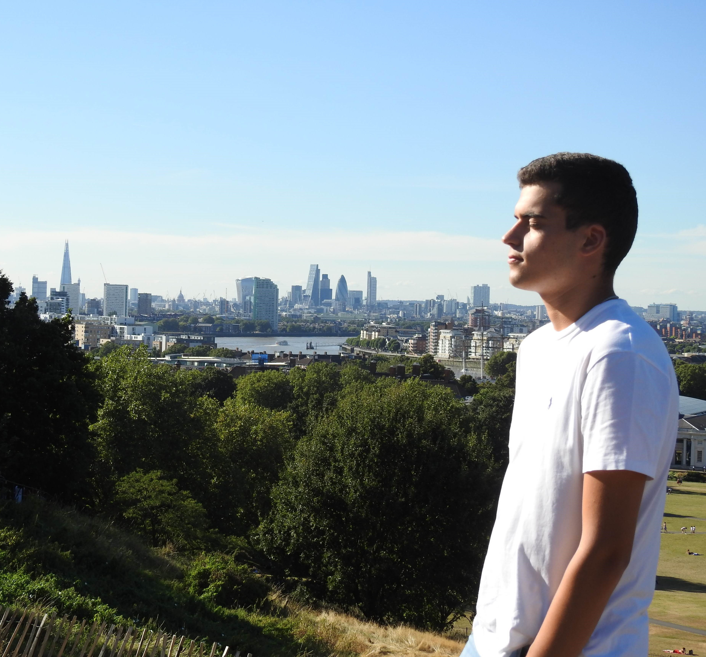

Hey there! My name is Francisco, I'm a Software Engineering student born and raised in Porto, Portugal. I'm currently enrolled in the first year of my [Masters's Degree in Informatics and Computing Engineering](https://sigarra.up.pt/feup/en/CUR_GERAL.CUR_PLANOS_ESTUDOS_VIEW?pv_plano_id=31204&pv_ano_lectivo=2021) @ [FEUP](https://sigarra.up.pt/feup/en/web_page.inicial). I have a great passion for software engineering as a whole with a special interest in frontend development at least for now.

On the more personal side of things, I would say I am a passionate person, who believes in finding true zeal in things and getting better as a person every day. I am hopelessly and irretrievably [portista](https://twitter.com/FCPorto) 🔵⚪. My interests are mostly music, gaming, football, media, and entertainment. As for hobbies, I often play the guitar, sing, game, program, and exercise.

## The roots

## The comeup
